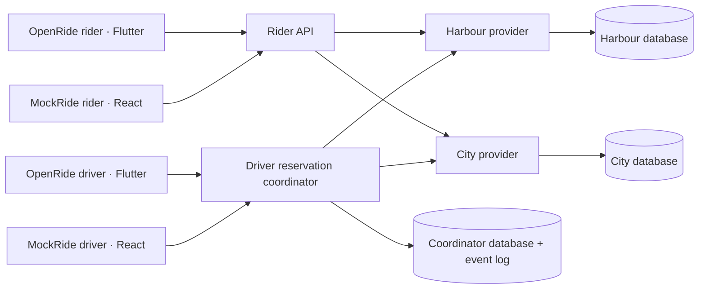

# OpenRide


An open ride-sharing service and a proposed interoperability protocol: one driver app, offers from multiple providers, one active booking across the participating network.

The mission is to give drivers more choice and build a community-led alternative without an OpenRide platform commission. This repository is an early reference implementation, not a launched transport service.

## Monorepo layout

| Folder                                                         | Responsibility                                              |
| -------------------------------------------------------------- | ----------------------------------------------------------- |
| [openride-protocol](openride-protocol/README.md)               | Specification, OpenAPI, TypeScript and Dart client packages |
| [openride-rider-frontend](openride-rider-frontend/README.md)   | Independent Flutter rider application                       |
| [openride-driver-frontend](openride-driver-frontend/README.md) | Independent Flutter driver application                      |
| [mockride-rider-frontend](mockride-rider-frontend/README.md)   | Independent React rider example                             |
| [mockride-driver-frontend](mockride-driver-frontend/README.md) | Independent React driver example                            |
| [openride-app-backend](openride-app-backend/README.md)         | Shared API, coordinator, interfaces and storage adapters    |
| [openride-design-system](openride-design-system/README.md)     | Styled Flutter components, branding and Widgetbook          |

See [database adapters and free Render setup](docs/storage-conformance.md), and [architecture decisions](docs/architecture.md) for the minimal-server approach and future distributed/P2P experiments.

## What runs today

- **Four separate apps:** OpenRide rider/driver in Flutter and MockRide rider/driver in React. Both Flutter projects include web, macOS, iOS and Android targets.
- Rider requests become provider offers; drivers in either brand accept, start and complete them. Riders see live progress through the same protocol.
- **OpenStreetMap** pickup/destination selection and driver stop maps, with coordinates shared through the protocol. See [map integration](docs/maps.md).
- **Independent provider pricing** with reviewed rider quotes and separate driver payouts.
- **OpenRide Protocol v0.1 draft** for offers, reservations and trip transitions.
- **Coordinator** that durably reserves the driver before contacting a provider.
- **Two simulated providers**, Harbour Cooperative and City Cooperative, with independent persistent databases and HTTP endpoints.
- Accept, start, complete and cancel a simulated trip; restart recovery; safe retries; provider outage handling.

No Uber, Bolt or inDrive integration is included. Adoption requires provider participation: a screen-scraping aggregator cannot guarantee that bookings made outside the protocol will respect the reservation.

## Run on your Mac

Prerequisites: Node.js 22 or later, pnpm 11.10+, and Flutter 3.44.6 / Dart 3.12.2. No Docker is required. The development databases use PGlite, a local Postgres engine, and persist under `.data/`.

```sh
git clone git@github.com:Sakyawira/OpenRide.git
cd OpenRide
pnpm install
pnpm build:frontends
pnpm dev
```

Open **http://127.0.0.1:4100/apps** for all four apps. Request a ride in OpenRide Rider, accept it in MockRide Driver, and follow its progress back in the rider app. Then try MockRide Rider with OpenRide Driver. See the [interoperability walkthrough](docs/interoperability.md). “New demo offers” adds offers without resetting active bookings. Offers expire after 30 minutes. Restart `pnpm dev` after building the web app if the coordinator was already running.

`pnpm dev` runs the coordinator on port 4100 and providers on loopback ports 4101 and 4102. Ctrl-C stops all three. Start from the repository root. The scripts read environment variables; `.env.example` is documentation and is not loaded automatically.

### Try the double-booking test

With both providers running and no active ride:

```sh
pnpm demo:race
```

This submits two different offers concurrently for the same demo driver. Expect one booking and one `409 DRIVER_BUSY`. The winner appears in the app; complete or cancel it there. `pnpm test` also covers lost replies after prepare/commit/trip actions, coordinator restart, duplicate requests and competing drivers.

### Test on your phone now

On a trusted local Wi-Fi network, start the coordinator with LAN access:

```sh
HOST=0.0.0.0 pnpm dev
```

Open `http://YOUR_MAC_LAN_IP:4100/apps` in the phone browser. Each app works on both devices. Instances of the same driver app share a demo identity; the two brands use different demo drivers by default. Set the same driver token in both brands to test one driver across two clients. The server defaults to loopback; this command deliberately exposes the development driver API on your LAN. The fixture token `openride-demo-driver` is public and gives control of that demo driver. The free Render configuration deliberately hosts this synthetic simulation; see the deployment guide before exposing it.

### Native Flutter targets

After installing the relevant native toolchain:

```sh
cd openride-driver-frontend
flutter doctor
flutter run -d macos
flutter devices
flutter run -d YOUR_DEVICE_ID --dart-define=OPENRIDE_URL=http://YOUR_MAC_LAN_IP:4100
```

macOS/iOS need full Xcode; a physical iPhone also needs signing and trust setup. Android needs the Android SDK. The Android debug manifest permits local HTTP; release builds require HTTPS. iOS includes local-network permission text and a local networking exception. On native apps, use Connection settings to change the server and role token; settings currently last for the app session only.

The initial development machine has Flutter and Chrome, but lacks full Xcode and the Android SDK. Native targets are scaffolded; native compilation and physical-device behavior still require verification.

## Architecture



The coordinator arbitrates driver availability with a database constraint. Each provider separately arbitrates its offers. Durable prepare/commit intent and idempotent commands bridge the two. Timeouts retain a blocking reservation until reconciliation; the app never assumes a timeout means a booking failed.

Read the [protocol draft](openride-protocol/SPECIFICATION.md) for exact invariants, states, HTTP endpoints and limitations. The current API schemas are generated into [OpenAPI](openride-protocol/openapi.json).

## Development

Brand assets and colour tokens follow the original repository logo. See [branding](docs/branding.md) for the palette and `pnpm brand:generate` to regenerate app icons from the editable SVG.

```sh
pnpm check
pnpm test
cd openride-driver-frontend
flutter analyze
flutter test
flutter build web --no-web-resources-cdn
```

Each frontend owns its entry point, dependencies, tests or checks, and build output. No frontend imports another frontend. The Flutter apps depend on `openride-protocol/dart` and `openride-design-system`; React apps depend on the protocol npm package. Root scripts start the three backend processes or the one-process hosted demo. Only one process may open each PGlite data directory. Deleting `.data/` discards all demo reservations and history; never reset a participant's data while other participants retain live bookings.

## Next milestones

1. Location permission, maps, automatic matching, real pricing and rider cancellation rules.
2. Real identity/authentication, linked identities across apps, and operational ownership/failover around the MongoDB adapter.
3. Provider onboarding and conformance tests, coordinator ownership/failover, signed messages, reconciliation operations and transport security.
4. Payments, safety workflows and operational readiness before handling real trips.
5. Reusable event-driven tutorials: subscribe to app events to guide onboarding with modal steps. Tutorial progress must never control booking correctness.

Federation, peer-to-peer transport, blockchain settlement, live GPS and real payments are not implemented. The durable event log is a foundation for integrations and tutorials; there is no message broker or webhook delivery service yet.

## License

GNU General Public License v3.0. See [COPYING](COPYING).
